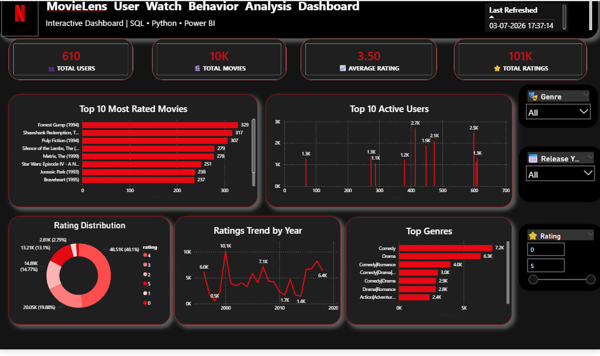

# 🎬 Netflix Analysis

## 📌 Project Overview
This project analyzes the Netflix Titles dataset using Python and Power BI to explore content trends, genres, ratings, release years, and country-wise distribution. The interactive dashboard provides valuable insights into Netflix's content library.

---

## 🎯 Objectives
- Analyze Netflix content distribution
- Explore movies vs TV shows
- Identify popular genres
- Study content ratings
- Analyze release trends over time

---

## 🛠️ Tools & Technologies
- Python (Pandas, NumPy, Matplotlib)
- Power BI
- Excel

---

## 📂 Dataset
The dataset contains Netflix titles with details such as title, type, genre, country, release year, duration, and rating.

---

## 📈 Dashboard Features
- Total Titles
- Movies vs TV Shows
- Content by Country
- Release Year Trend
- Rating Distribution
- Genre Analysis
- Top Producing Countries
- Duration Analysis

---

## 💡 Key Insights
- Movies represent the majority of Netflix content.
- Content production increased significantly after 2015.
- Drama and International Movies are among the most common genres.
- The United States contributes the largest share of titles.
- TV-MA is one of the most frequent content ratings.

---

## 📷 Dashboard Preview

---

## 📁 Repository Contents

- `netflix_titles.csv` – Dataset
- `Netflix_Analysis.ipynb` – Python Analysis
- `Netflix_Dashboard.pbix` – Power BI Dashboard
- `Netflix_Dashboard.pdf` – Dashboard Report
- `netflix_dashboard.png` – Dashboard Screenshot

---

## 🚀 Skills Demonstrated
- Data Cleaning
- Exploratory Data Analysis (EDA)
- Python (Pandas)
- Power BI Dashboard Development
- Data Visualization
- Business Intelligence

---

## 👤 Author

**Sanju Dagar**

Aspiring Data Analyst | SQL | Python | Power BI | Excel
